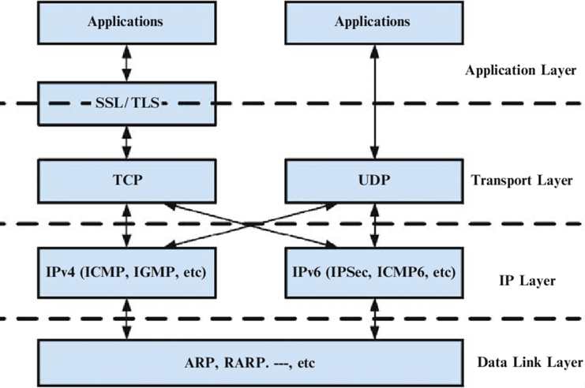
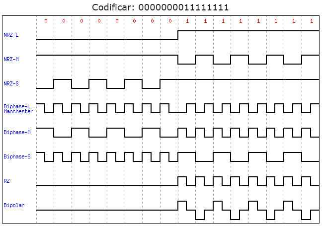
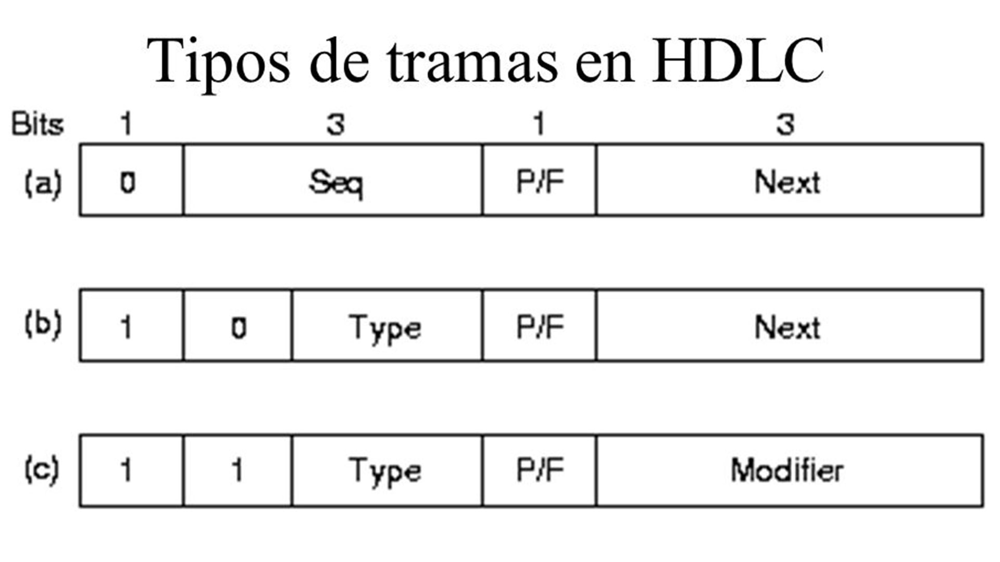
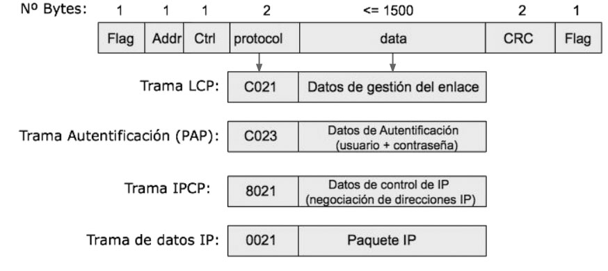
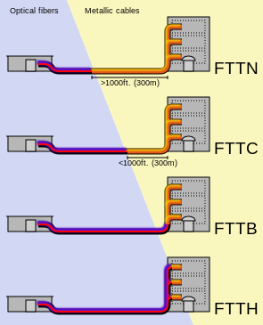

\renewcommand{\contentsname}{Tabla de contenidos}

\tableofcontents

\newpage

\section{1. Tipos de redes}

\subsection{1. 1. Conexión punto a punto.}
1. Necesitan $n$ dispositivos, $\frac{n(n-1)}{2}$ enlaces.
2. Cada dispositivo necesita muchas entradas y salidas.    
__Solución__: Uso de redes *LAN* y *WAN* conmutadas.

\subsection{1. 2. Redes de área local (\textit{LAN}).}
1. Son privadas, con cobertura limitada e identificados.
2. Mensajes contienen información del emisor y del receptor.

\begin{multicols}{2}
	\subsubsection{Broadcast.}
 	Funcionan por difusión, donde pueden producirse \textbf{colisiones} si dos envían y uno recibe, invalidándo la información.
	\begin{itemize}
	  \item \textbf{Bus} (Ethernet 10Base2)
	  \item \textbf{Hub (Estrella)} (Ethernet 10Base2)
		\item \textbf{WLAN (Wireless)} (Wifi)
	\end{itemize}
\columnbreak
	\subsubsection{Switched.}
	Sistema de dispositivos conectados a un switch, la información se \textbf{envía directamente}, por lo que no puede colisionar.
	\begin{itemize}
		\item \textbf{Switch (Estrella)} (Fast Ethernet 100Base-TX)
	\end{itemize}
\end{multicols}

\newpage

\subsection{1. 3. Redes de área extensa (\textit{WAN}).}

1. Utilizada en áreas geográficas grandes.
2. Gestionado por empresas de comunicación.
3. Tipos:
$\left\{
\begin{minipage}{8cm}
  \textbf{Punto a punto}: Conectan 2 dispositivos por un medio, ADSL e ISP (Proveedor de acceso). \\*
  \textbf{Conmutación de circuitos}: Se establece un circuito entre los exremos, los switches no realizan procesamiento de información, es decir se utilizan como canales. Por ejemplo, Centrales telefónicas (PSTN). \\*
  \textbf{Conmutación de paquetes}: La información se divide en bloques, los switches procesan los paquetes.
  \begin{enumerate}
    \item \textbf{Routing} (\textit{Encaminamiento}): Deciden la ruta más adecuada.
    \item \textbf{Fowarding} (\textit{Reexpedición}): Envía el paquete al siguiente nodo.
  \end{enumerate}
  \textbf{Redes de datagramas} (Redes IP): Se encaminan según la función de destino, llegando sin orden. \\*
  \textbf{Redes de circuitos virtuales} (Redes Async Transfer Model): Se encaminan según al circuito al que pertenecen, llegando en orden. El camino lo puede utilizar distintos paquetes.
\end{minipage}
\right.$

\subsection{1. 4. Interred (\textit{Internet}).}

1. Conexión de varias *WAN* o *LAN* unidas mediante routers.
2. El router realiza el "*Encaminar*" (__Routing__) y la "*Reexpedición*" (__Fowarding__) entre las distintas redes.
3. Los usuarios se conectan a través de un proveedor de *Acceso residencial de internet* (__ISP__) a través de una conexión de acceso residencial.
4. Tipos de __ISP__:
$\left\{
\begin{minipage}{8cm}
  \textbf{Regionales}: Forman el segundo nivel, conectándose a uno o varios backbones. \\*
  \textbf{Locales}: Dan servicio a los usuarios finales, se conectan a los regionales o backbones. \\*
  \textbf{Backbones (Columna vertebral)}: Interconectan mediante \textit{Network Access Points} (\textbf{NAPS}) o \textit{Internet exchange points} (\textbf{IXP}) o \textit{Puntos neutros} (Complejos y caros).
\end{minipage}
\right.$

\newpage

\section{2. Arquitectura de protocolos}
Definen las reglas que ambos extremos necesitan para comunicarse, que a su vez se dividen en tareas (Aquitectura en capas).

\subsection{Características}

1. Cada capa tiene una serie de funciones bien definidas.
2. __Servicios__: La capa $k$ se puede comunicar utilizando estos servicios con la capa $k-1$.
3. Las capas del mismo nivel comparten reglas, en la comunicación se establece una conexión lógica con cada capa.
4. __Arquitectura__: Conjunto de capas, servicios y protocolos.

\subsection{2. 1. Encapsulamiento.}
El mensaje en cada nivel añade en su cabecera información de cada capa (protocolo).
La \textit{capa de transporte} incluye información sobre el orgien y destino, control de errores (\textit{checksum}) o control de flujo.

La \textit{capa de red} añade información sobre los hosts de origen y destino, control de errores y fragmentación.

La \textit{capa de enlace} incluye la dirección de enlace de los extremos.

\subsection{2. 2. Desencapsulamiento.}
Cuando un mensaje se recibe, esta es enviada a las capas superiores, cada paso conlleva una comprobación de erorres. Los routers son capaces de reencapsular mensajes según el tipo de enlace.

\subsection{2. 3. Transmission Control Protocol / Internet Protocol}
Son protocolos utilizado en Internet, su jerarquía son módulos.

\begin{multicols}{2}
	\subsubsection{Capa de aplicación.}
  Realiza intercambios entre dos programas, una conexión extremo a extremo con lógica de la aplicación.
  Los protocolos más utilizados son \textit{HTTP}, \textit{SMTP}, \textit{FTP}, \textit{DNS}...

  \subsubsection{Capa de transporte.}
  Conmutación extremo-extremo, se encapsula el mensaje en un segmento o datagrama.
  Técnicas utilizadas como \textbf{TCP}: Control de flujo, errores y congestión o \textbf{UDP}: Sin conexión, sin ventajas.

  \columnbreak
  \subsubsection{Capa de red.}
  Comunicación entre los hosts, se encarga de enviar los paquetes por el mejor camino.
  El protocolo utilizado se encarga de:
  \begin{enumerate}
    \item Definir el formato del paquete o datagrama.
    \item La forma en la que se designan los hosts (direcciones).
    \item Encaminamiento (Unicast o Multicast).
    \item Protocolos como IGMP, ARP, ICMP.
  \end{enumerate}

  \subsubsection{Capa de enlace de datos.}
  Transmite los datagramas por el enlace, estos datagramas son encapsulados en un marco (frame). No existe un protocolo en particular, algunos ofrecen correción de errores. Aparce en las \textit{LAN con switches}, \textit{Wifi}, \textit{WAN cambleada}...

  \subsubsection{Capa física.}
  Responsable del envío de bits por el enlace (Electromagnético), realiza la codificación, conversión y multiplexación.

\end{multicols}

\section{2. 4. Modelo OSI}
Permite la comunicación entre dos sistemas independientes. No es un protocolo, si no un modelo para el desarrollo en capas. La capa de aplicación (A diferencia de \textbf{TCP/IP}), se divide en 3 capas, la capa de aplicación, de presentación y de sesión, algunas de estas capas son abstraidas en el modelo \textbf{TCP/IP} en la capa de transporte.

\newpage

\section{3. Datos y Señales}
Los datos son entidades de información, estos puedes ser: \textbf{Analógicos}, es decir contínuos dentro de un intervalo o \textbf{digitales}, valores discretos.
Las señales (que pueden ser eléctricas o electromagnéticas) también pueden ser \textbf{analógicas}, es decir, varía de forma contínua en un rango o \textbf{digitales}, secuencia de pulsos discretos y contínuos.
Según las combinaciones de estos encontramos.

$\left\{
\begin{minipage}{8cm}
  \textbf{Datos y señales analógicas}: Técnicas de modulación (AM y FM), como por ejemplo la telefonía analógica. \\*
  \textbf{Datos analógicos y señales digitales}: Técnicas de digitalización (PCM), como por ejemplo la radio, la TV digital... \\*
  \textbf{Datos digitales y señales analógicas}: Técnicas de modulación (ASK,  PSK, QPSK, QAM), como por ejemplo la conexión módem y ADSL. \\*
  \textbf{Datos y señales digitales}: Técnicas de codificación (NRZ, NRZI, Bipolar Manchester), como por ejemplo el Ethernet.
\end{minipage}
\right.$

\subsection{3. 1. Elementos de señal y datos}
Un \textbf{elemento de señal} es cada uno de los distintos estados de la señal que se utilizan para codificar datos binarios.
Un \textbf{elemento de dato} es uno o varios elementos de señal. Donde $R$ es la relación de bits/elemento de señal (baudio = simbolos/segundo, \textit{R}). Para codificar $R$ bits, es necesario $V=2^R$ símbolos distintos.
La \textbf{tasa de baudios} (baud rate \textit{B}) es el número de veces que puede cambiar el estado de la señal por unidad de tiempo.
La \textbf{tasa de bits} (bit rate, \textit{C}), es el número de bits por unidad de tiempo

Existe una relación entre bits y baudios $C = R\times B$

\subsection{3. 2. Espectro en frecuencias y ancho de banda}
El espectro de frecuencias es el conjunto de componentes en frecuencia o armónicos ($f$ de Fourier) que componen la señal.
El ancho de banda, puede ser absoluto que es la diferencia entre la frecuencia más alta y la más baja (puede ser $\infty$) o puede ser efectivo, que es la parte del ancho de banda donde se encuentra la mayor energía de la señal.
En un canal de transmisión, el ancho de banda es el rango de frecuencias en el que se puede transmitir para una distancia determinada sin atenuar ($H=f_{corte superior} - f_{corte inferior} = f_s - f_i$).
Existen dos tipos:

1. \textbf{Paso bajo}: $f_i = 0, \forall f \mid f \leq f_s$
2. \textbf{Paso banda}: $f_i > 0, \forall f \mid f_i \leq f \leq f_s$

#### Ejemplo

Supongamos que queremos transmitir ($10101...$) a $2Mbps$ utilizando los $3$ primeros armónicos ($1f, 3f, 5f$).
$$ 2Mbps = \dfrac{2\cdot 10^6 bits}{segundos} \rightarrow \dfrac{1}{2\cdot 10^6} s $$
El periodo de $2$ bits $P = \dfrac{2}{2\cdot 10^6} s = 1\mu s$ por lo que la frecuencia $f=\dfrac{1}{P}= 1$ MHz.

Es fácil observar que la frecuencia de corte inferior $fi \leq (1f = 1MHz)$ y que la frecuencia de corte superior, $fs \leq (5f = 5MHz)$, por lo que el ancho de banda será $H=f_s-f_i=4MHz$.

\subsection{3. 3. Relación ancho de banda y velocidad de transmisión}
A mayor velocidad de transmisión, mayor ancho de banda se necesita (y viceversa), su capacidad de transmisión depende de:

1. \textbf{Un canal ideal}. \textit{Teorema Nyquist}: $C_n=B_{max}\cdot R = 2HR$, siendo $B_{max}$ la tasa de baudios máxima.
2. \textbf{Un canal con ruido}. \textit{Teorema de Shannon}: $C_s=H\log_2\left(1+\dfrac{S}{N}\right)$, siendo $\dfrac{S}{N}$ la relación señal-ruido.

\subsection{3. 4. Atenuación}
La \textbf{atenuación} es la energía decaída durante la distancia recorrida, la limitación en el ancho de banda es a causa de la elevada atenuación en las frecuencias fuera del rango de las frecuencias de corte del canal.
$$\text{Atenuación}_{db} = 10 \log\left(\dfrac{P_r}{Rt}\right)$$
Siendo $P_r$ la potencia recibida y $R_t$ la potencia transmitida.

\subsection{3. 5. Espectro en frecuencias y ancho de banda}

1. __Ruido Blanco__: Este es debido a la agitación de electrones en el conductor.
2. __Diafonía__: Un ruido producido por las señales cercanas.
3. __Ruido Impulsivo__: Provocado por tormentas, fallos en el sistema...

Existe una __relación señal/ruido (SNR)__, viene dada por $SNR=10\log\left(\dfrac{S}{N}\right)$, cuanto más alto sea el valor, mejor la calidad.

\newpage

\section{4. Transmisión digital}
Es decir, se transmiten datos digitales, usando señales digitales.

1. Aprovechan el ancho de banda (Incrementando la tasa de bits y decrementando la tasa de baudios).
2. Auto-sincronización (El intervalo de bits del receptor es igual que el del transmisor), esto se consigue enviando mensajes de inicio, finalización y paso medio de mensajes.
3. Evitar varciaciones de la __línea base__, es decir, se *decodifica*, calculando la potencia media recibida y se determina el valor de cada bit comparando la potencia recibida con la línea base.
4. Evita componentes de corriente contínua (*DC*), el nivel de voltaje es contante, por lo que el espectro crea frecuencias bajas, esto provoca problemas en sistemas que usan frecuencias bajas.

\subsection{4. 1. Codificiaciones}
Existen dos tipos de codificaciones: __en línea__ (*line coding*), convierte una secuencia de bits en señal digital o __en bloque__ (*block coding*), transforma bloques de $m$ bits en códigos de $n$.
La codificación __en bloque__, contiene bits redundantes para garantizar la sincronización y la detección de errores, los códigos resultantes se codifican en línea.

\subsection{4. 2. Tipos}
\subsubsection{Unipolar (\textit{NRZ[Non-Return Zero]})}
Si el voltaje es igual a $0$, entonces se envía un \textbf{cero}, si es mayor a cero, se envía un \textbf{uno}.

\begin{enumerate}
  \item Es fácil de implementar, se utiliza $1$ bit por elemento de señal, sin sincronización con \textit{DC}.
  \item La línea Base $\neq 0$ y creciente cuando se envían muchos unos.
  \begin{enumerate}
    \item \textbf{NRZ-L}. 0 si el voltaje es bajo, 1 si el voltaje es alto.
    \item \textbf{NRZ-I}. 0 si se mantiene el voltaje, 1 si el voltaje varía.
  \end{enumerate}
\end{enumerate}

\subsubsection{Polar}
\begin{enumerate}
  \item \textbf{RZ} (\textit{Zero Return}). 3 niveles (Voltaje negativo, Voltaje nulo y voltaje positivo), permitiendo sincronización, su tasa de baudios es 1/2. Envía un 0 si el voltaje pasa de negativo a cero o envía un 1 si el voltaje pasa de positivo a cero.
  \item \textbf{Bifase}. 2 niveles (Voltaje negativo, voltaje positivo). Cada elemento se codifica en la mitad del intervalo.
  \begin{enumerate}
    \item \textbf{Manchester}. 0 si voltaje alto seguido de uno bajo y 1 si lo contrario.
    \item \textbf{Manchester Diferencial}. 0 si hay una transición al inicio del intervalo y 1 si existe una ausencia.
  \end{enumerate}
\end{enumerate}

\subsubsection{Bipolar}
Utiliza 3 estados (Como RZ).
\begin{enumerate}
  \item \textbf{Alternate Mark Inversion} (\textit{AMI}). Si el voltaje es 0, se envía un cero, por el contrario, se envía un 1.
  \item \textbf{Pseudo ternaria}. Opuesto al anterior, el valor medio base es cero y la tasa de baudios 0 (Es un sistema complejo).
\end{enumerate}

> Visualizador online en: http://www.ee.unb.ca/cgi-bin/tervo/encoding.pl

\subsubsection{Condificación multinivel}
Varios niveles que permiten codificar varios bits, por lo que hay una alta tasa de bits.
\begin{enumerate}
  \item \textbf{2B1Q}. 2 bits, 1 4-upla (4 estados, 2 positivos y 2 negativos), por lo que la tasa de baudios es 1/2.
  \item \textbf{8B6T}. 8 bits, 1 3-upla ($-V, 0, +V$), por lo que la tasa de baudios es 8/6.
  \item \textbf{4D-PAM5}. 4 cables simultáneos, capaz de enviar 2bits/elemento de señal por cada cable, con una tasa de baudios de 2 y 5 niveles, encontramos los voltajes (+2, +1, -1, -2) Voltios y el voltaje nulo es utilizado de control.
\end{enumerate}

\subsubsection{Condificación multitransición}

\newpage

\subsubsection{Codificación en bloque}
Hay bits redundantes para la sincronización y la gestión de errores, se codifican $n$ bits en línea.
\textbf{4B/5B} (4bits to 5 bits). No contienen más de 1 cero al principio ni más de dos al final, garantizando así que no se envíen más de 3 ceros seguidos, se utiliza una codificación \textbf{NRZ-I}.

\newpage

\section{5. Transmisión Analógica}
Los \textbf{módens} se encargan de la \textbf{modulación}, es decir una conversión de datos digitales a una señal analógica y la \textbf{demodulación}, que es lo opuesto. Las señales tienen una \textit{forma sinusoidal}.

$$ A \sin (2\pi\omega + \theta) $$

El rango de frecuencias de datos es distinto al rango medio (debe estar entre $0$ y $f$).
Por multiplexación*

\subsection{5. 1. Tipos de modulaciones}
\begin{enumerate}
  \item \textbf{Amplitud} (\textit{ASK}). La frecuencia y la fase son constantes, dos amplitudes distintas que represental al 0 y al 1.
  \item \textbf{Frecuencia} (\textit{FSK}). La amplitud y la fase son constantes, dos frecuencias distintas para representar al 0 y al 1.
  \item \textbf{Fase} (\textit{PSK}). La amplitud y la frecuencia son constantes, dos fases distintas para representar al 0 y al 1.
  \begin{enumerate}
    \item \textbf{2PSK o BPSK} (Binario), dos fases, R = 1.
    \item \textbf{4PSK o QPSK} (Binario), cuatro fases, R = 2.
    \item \textbf{8PSK} (Binario), ocho fases, R = 3.
  \end{enumerate}
  \item \textbf{Amplitud en cuadratura} (\textit{QAM}). Combina \textbf{PSK} y \textbf{ASK} (Fases y amplitudes).
  \begin{enumerate}
    \item \textbf{8-QAM}. 8 elementos de señal, R = 3.
    \item \textbf{16-QAM}. 16 elementos de señal, R = 5.
    \item \textbf{32-QAM}. 32 elementos de señal, R = 4.
  \end{enumerate}
  En ADLS, se codifican 15 bits por baudio.
\end{enumerate}

\newpage

\section{6. Multiplexación}
Multiplexación por división de la frecuencia en medios de transición de gran ancho de banda, es decir, se divide en varios subcanales para así poder enviar de forma simultánea a menor velocidad.
Es aplicado cuando el ancho de banda del enlace es mayor al de las señales transmitidas.

\subsection{6. 1. Multiplexación por división de frecuencia (\textit{FDM})}
Cada canal (n canales) tiene su propia técnica de modulación (6.1) y portan frecuencias distintas. Por seguridad, añaden bandas de guardia (n - 1 bandas) para evitar solapamientos.

El emisor utiliza moduladores para enviar y el receptor utiliza filtros y demoduladores para interpretar la señal.

\subsection{6. 2. Multiplexación por división de tiempo (\textit{TDM})}
Permite compartir el ancho de banda entre diferente conexiones, el tiempo de transmisión se divide en intervalos idénticos. Cada dispositivo tiene asignado un intervalo para transmitir.

Estos pueden ser \textbf{síncronos}, es decir, un intervalo fijo (ranura), si esta no se utiliza, se desperdicia o \textbf{estadísticos}, una reserva dinámica de intervalos.

\newpage

\section{7. Medios de transmisión. Capa física}
\subsection{7. 1. Medios Guidados (\textit{Wired})}
\begin{enumerate}
  \item \textbf{Trenzados}. Forma elicoidal, podemos encontrar UTP (No están protegidos) o STP (Si lo están)
  \begin{enumerate}
    \item \textbf{UTP-3}. $16 MHz$, calidad telefónica, una red de $10Mbps$ para longitudes menor de 100 metros.
    \item \textbf{UTP-5}. $100 MHz$, calidad de datos, una red de $100Mbps$ para longitudes menor de 100 metros.
  \end{enumerate}
  \item \textbf{Coaxiales}. Se utiliza el cobre más un conductor (BNC [Ethernet]), como por ejemplo la televisión por cable, telefonía de larga distancia o LAN Bus: 10Base2 (máximo 185 metros de longitud), 10Base5 (máximo 500 metros de longitud).

  A diferencia de los trenzados, estos son más inmunes a interferencias y soportan mayores distancias, pero más caros.
  \item \textbf{Fibra óptica}.
  Combina el plástico y el vídreo, dentro de un cable, encontramos decenas o cientos de fibras. Basados en la \textit{ley de Snell}, es decir el ángulo de incidencia es mayor al ángulo crítico $\theta_c$ por lo que solo se produce refracción. Según el $\theta_c$: \textbf{escalonados} si dicho ángulo es \textbf{constante} o \textbf{granulados} si este varía.

  \begin{enumerate}
    \item \textbf{Mononodo}. Existe una única dirección (línea recta), tiene poca pérdida, pero es cara y difícil de manejar.
    \item \textbf{Multinodo}. Existen muchas direcciones, es barata y fácil de manipular, pero tiene más errores.
  \end{enumerate}
\end{enumerate}

\newpage

\section{8. Capa de enlace}
Podemos encontrar dos tipos, \textbf{punto a punto} o \textbf{multi-punto}.
Sirve para ofrecer servicios y mecanismos para convertir un enlace físico (con errores) a uno lógico (sin errores).

Según el sentido al que se transmite la información, encontramos:
\begin{enumerate}
  \item \textbf{Simplex} (1 sentido). Uno emite y el otro recibe.
  \item \textbf{Half-duplex} (sentidos alternados). Se alterna la recepción y la emisión.
  \item \textbf{Full-duplex} (simultáneo). Se envía o se recibe simultáneamente.
\end{enumerate}

Se encarga de la gestión de errores, la delimitación de cada trama al inicio y al final, la fiabilidad del servicio, etc.

\subsection{8. 1. Técnicas de detección de errores}
\begin{enumerate}
  \item \textbf{Checksum}. Basado en la paridad de bit, es muy poco robusto.
  \item \textbf{Código de redundancia cíclica} (\textit{CRC}). Divide la secuencia entre una secuencia fija con $(n+1)$ bits y el resto se agrega como trama (CRC-32, CRC-16).
  \item \textbf{Retransmisión automática} (ARQ). Por cada trama enviada se activa un temporizador y el emisor recibe un mensaje \textbf{ACK} (\textit{Acuerdo/Acknowledge}), si la trama \textbf{no} contiene errores (Algunos sistemas envían una trama \textbf{NAK}, si se recibe, se vuelve a reenviar la trama sin esperar), entonces, el temporizador acaba y se vuelve a reenviar.  
\end{enumerate}

\subsection{8. 2. Funciones de enlace multipunto}
Deben identificar cada una de las estaciones e identificar cada una de las tramas con su origen y destino. También, detectan colisiones (ocurridas cuando dos o más estaciones acceden al medio).
\subsection{8. 3. Servicios de enlace de datos}
\begin{enumerate}
  \item \textbf{Conexión fiables}.
  \begin{enumerate}
    \item Encargados de establecer, transmitir y finalizar la conexión.
    \item Detectar errores y descartar tramas (y retransmitir), entregándose a la capa superior sin errores.
    \item Enumeración de tramas y confirmación de la llegada.
    \item Existe un control de flujo para evitar la saturación del canal.
  \end{enumerate}
  \item \textbf{Conexión no fiables} (Sin conexión).
  \begin{enumerate}
    \item No hay fase de establecimiento ni fin de conexión.
    \item No se garantiza una entrega fiable, descartando tramas erróneas.
    \item Las tramas no están enumeradas, son independientes y no hay confirmación de llegada.
    \item Tampoco hay control de flujo.
  \end{enumerate}
\end{enumerate}
Encontramos diferentes control de enlace.

\begin{enumerate}
  \item \textbf{High level data link control}. Tiene dos modos distintos de operar.
  \begin{enumerate}
    \item \textbf{Normal Response Mode} (\textit{NRM}). Categoría \textit{maestro-esclavo} y una conexión half-dúplex.
    \item \textbf{Asynchronouse Balanced Mode} (\textit{ABM}). Categoría \textit{computador-computador}, todas las estaciones tienen la misma categoría y pueden transmitir en cualquier momento.
  \end{enumerate}
  Las tramas que define son:
  \begin{enumerate}
    \item \textbf{Trama I} (Información). Transporta datos de la capa superior (fiable). \\*
    La secuencia es de 3 bits en conexiones normales y 7 bits en conexiones extendidas, encargado de controlar errores y el flujo.\\*
    El bit P/F se activa cuando el temporizador ha expirado o no se ha recibido la información, si está en modo \textbf{NRM}, indica si el escalvo tiene que confirmar la trama.\\*
    La secuencia Next envía confirmaciones superpuestas (\textit{piggy-backing}), en \textbf{modo ABM}
    \item \textbf{Trama S} (supervisora). Confirma la trama y controla el flujo y errores. \\*
    Existen diferentes tipos de tramas supervisoras.
    \begin{enumerate}
      \item \textbf{Reception Ready} (\textit{RR}). Parecido a \textbf{ACK}, confirmar tramas en caso de no existir en tráfico continuo. Next contiene la siguiente trama a recibir.
      \item \textbf{Reject} (\textit{REJ}). Parecido a \textbf{NACK}, emitido cuando se recibe una trama errónea, rechazanado todas las tramas que llegan y luego retransmitir estas rechazadas.
      \item \textbf{Selective Reject} (\textit{SREJ}). Cuando se recibe una trama errónea, se envía esta con el número de confirmación (Next) que se debe retransmitir.
      \item \textbf{Receptor Not Ready} (\textit{RNR}). El emisor suspende el envío de tramas y se confirman todas las anteriores, se envía \textbf{RR} para reiniciar los envíos.
    \end{enumerate}
    \item \textbf{Trama U} (Sin numerar). Confirma las tramas sin numerar (fiable y no fiable), rechaza tramas, reinica conexión.
    \begin{enumerate}
      \item \textbf{Set NRM} (\textit{SNRM}). 3 bits
      \item \textbf{Set ABM} (\textit{SABM}). 3 bits
      \item \textbf{Set NRM Extended} (\textit{SNRME}). 7 bits
      \item \textbf{Set ABM Extended} (\textit{SABME}). 7 bits
      \item \textbf{Disconnected} (\textit{DISC}).
      \item \textbf{Unnumbered ACK} (\textit{UA}).
      \item \textbf{Unnumbered Information} (\textit{UI}).
      \item \textbf{Frame Rejected} (\textit{FRMR}).
      \item \textbf{Reset} (\textit{RSET}).
    \end{enumerate}
  \end{enumerate}
\end{enumerate}

\newpage

\subsection{8. 4. Protocolo Punto a Punto (\textit{PPP})}
Con el formato de trama de \textbf{HDLC}, usado para encapsular tráfico \textbf{IP}, como puede ser la conexión \textbf{ADSL} (\textit{PPPoE o PPP over ATM}) o conexiones de teléfono entre usuario y proveedor de internet (\textit{ISP}).

Las funciones son control de enlace, conexión y configuración, especificando el tamaño máximo de la trama, autentificación de usuario, mediante Password Auth Protocol (\textit{PAP}) o Challenge Handshake Authentification (\textit{CHAP}),.

\newpage

\section{9. Redes de área local (\textit{LAN})}
Esta tecnología requiere de una \textbf{MAC} para resolver colisiones, conectando distintas \textbf{LAN} mediante \textbf{bridges} que convierten las tramas de una red a otra.

En estas tecnologías, se pueden utilizar los \textbf{hubs} (actúan en la capa física) que se encargan de retransmitir a todas las salidas la misma trama o los \textbf{switches} (nivel de enlace), es utilizado de filtro y retransmite por la salida adecuada.

Encontramos los siguientes protocolos.
\begin{enumerate}
  \item \textbf{IEEE802}. Dividido en dos subniveles, \textbf{Logical Link Control} (\textit{LLC}), una interfaz con las capas superiores, controla flujo y los errores o \textbf{Media Access Control} (\textit{MAC}), ensambla y desensambla de tramas con campos de dirección.
  \item \textbf{LLC}.

  Ofrece dos tipos de servicios, para conexiones \textbf{seguras}: establece conexión con tramas sin numerar (SABM o UA); para la transmisión de datos, enviando tramas de datos de \textbf{tipo I} o tramas supervisoras de tipo \textbf{RR}, \textbf{REJ}, \textbf{RNR} y tramas de desconexión, tipo \textbf{DISC} o \textbf{UA}. Para conexiones \textbf{inseguras}, solo se transmiten tramas de datos de tipo \textbf{UI}.

  \textbf{IP} sobre \textbf{LLC} utiliza únicamente servicios sin conexión.
\end{enumerate}  

\newpage

\section{9. Redes de área local Ethernet (\textit{LAN Ethernet})}
\begin{enumerate}
  \item \textbf{Bus}. Cable coaxial utilizando método de difusión, con conexión \textit{half-duplex}, pudiendo provocar colisiones.
  \item \textbf{Hub/Switch}. El hub (par trenzado), utiliza repetidores y una conexión \textit{half-duplex}, mientras que el switch (conmutador), encuentra la salida adecuada y utiliza una conexión \textit{full-duplex}.
  \item \textbf{Estrella}. Fibra óptica y uso de un switch.
\end{enumerate}
\subsection{9. 1. Carrier Sense Multiple Acess (\textit{CSMA})}
Cuando el emisor tiene una trama lista oara transmitir, escucha el canal, enviándose y si está todo bien, el receptor envía una trama \textbf{ACK}, en caso de colisión, se añade un delay aleatorio para evitar que vuelva a ocurrir.

\subsection{9. 2. Carrier Sense Multiple Acess (\textit{CSMA/CD})}
Existe una variación conocida como \textbf{CSMA/CD} que predice colisiones y se anticipa a la retransmisión. Se asigna un tiempo máximo de detección de colisiones.
$$ \tau = 2 \cdot T_p $$
Donde $\tau$ es la ranura temporal y $T_p$ el retardo máximo de propagación de la señal.
$$T_x\ge \tau \rightarrow T_x=\dfrac{\text{Tamaño de trama}}{\text{Velocidad de transmisión}} \ge \tau$$
Si ocurre una colisión, se genera un número aleatorio y se espera un intervalo de tiempo $m\cdot \tau$.

\subsubsection{Ejemplo}
En Ethernet, $T_p=25,6\mu s \rightarrow \tau = 2T_p=51,2\mu s$ y $V_T=10Mbps$ por lo que el tamaño de trama $\ge \tau\cdot V_T = 521bits\rightarrow V_T \ge 64 bytes$.

\subsection{9. 3. Trama Ethernet}

En el preámbulo se repite $10101010$ 7 veces (para sincronización con el emisor).
El campo \textbf{SFD} el valor $10101011$ para delimitar el inicio.

La \textbf{dirección MAC} y la \textbf{Ethernet} son iguales a la dirección física (hardware).

La \textbf{MAC de destino} puede ser \textit{unicast}, es decir, una estación; \textit{multicast}, un grupo de estaciones o \textit{broadcast}, todas las estaciones (FF:FF:FF:FF:FF:FF).

La \textbf{MAC de origen} solo se acepta \textit{unicast}.

En el \textbf{estándar 802.3} el campo ($\le 1500$) En \textbf{Ethernet II} el campo Tipo ($\ge 1501$), indicando el protocolo de la capa superior, $IP = 0x0800$ o $ARP = 0x0806$.  

Si los datos son menos de 47 bytes, se rellena hata 64 bytes utilizando un padding.

Se utiliza un código \textbf{CRC-32}.

\textbf{TCP/IP} sobre Ethernet, \textbf{IP} un protocolo sin conexión, servicios \textbf{LLC} y tramas \textbf{UI}.

\subsection{9. 4. Funcionamiento Switches}
\begin{enumerate}
  \item \textbf{Store-and-foward}. Acepta la trama y la almacena temporalmente, pudiendo descartar así las tramas errónea, pero el tener que gestionar memoria, hace que sea más lento.
  \item \textbf{Cut-through} (Truncamiento). Recibe e envía directamente leyendo de la trama la dirección MAC a enviar  (tardando menos), no hay detección de errores.
  \item \textbf{Self Learning} (Autoaprendizaje). Guarda las direcciones \textbf{MAC} de cada puerto, cada entrada contiene además el número de puerto y marca de tiempo, así descartando entradas antiguas.
  Si se recibe una trama desconocida, se realiza \textit{Broadcast}, so hay un ciclo cerrado y puentes, puede ocurrir bucles, esto se soluciona utilizando árboles de expansión (\textit{STP}), que combina topologías físicas y lógicas. El algoritmo minimiza saltos, retardos o maximiza el ancho de banda. Si se cambia la topología, se recalcula el árbol.
\end{enumerate}

\subsection{9. 5. Dominio de colisión}
Conjunto de máquinas de una red que pueden producir colisiones entre sí (Cuando se produce una, afecta a todo el sistema).

\begin{enumerate}
  \item \textbf{Conexión de segmentos 10Base2 o 10Base5} mediante \textbf{Repetidores} para ampliar el alcance.
  Entre dos estaciones no puede haber más de 4 repetidores (Pertenece todo al conjunto de colisiones) ni tampoco lazos cerrados.
  \item \textbf{Hubs 10Base-T}, se conectan hubs mediante \textit{cables cruzados} (100m), también máximo 4 hubs.
  \item \textbf{Hubs 100Base-TX}, como máximo 2 hubs y un alcance máximo de 5 metros.
\end{enumerate}
Se pueden conectar estos sistemas mediante Hubs y Switches 100Base-TX

\newpage

\section{10. Fidelity IEE 802.11 (\textit{WiFi})}
Tiene un protocolo de acceso al medio, \textbf{distribuido} (\textit{PCF}) o centralizado (\textit{PCF}). Las implementaciones físicas son 802.11[a, b, g, n]

Pueden o no tener infraestructura.
\begin{enumerate}
  \item \textbf{Con infraestructura}. Se comunican utilizando un \textbf{Punto de acceso} (\textit{AC}), tienen dirección \textbf{MAC}, que funciona como un hub inalámbrico.
  \item \textbf{Sin infraestructura} (Ad-hoc). Las estaciones inalámbricas se comunican directamente entre sí.
\end{enumerate}

Conjunto de servicios.
\begin{enumerate}
  \item \textbf{Basic Service Set} (\textit{BSS}) (Identificados por un \textbf{BSSID}).
  \begin{enumerate}
    \item Es el bloque constitutivo básico de una \textbf{WLAN}, que puede o no tener infraestructura.
    \item Si no tiene infraestructura se conoce como \textbf{IBSS}, es una red aislada, \textbf{BSSID} es aleatorio.
    \item Un \textbf{BSS} con infraestructura se puede comunicar con otras redes a través del \textbf{AP}, el \textbf{BSSID} es la \textbf{MAC} del \textbf{AP}.
  \end{enumerate}
  \item \textbf{Extended Service Set} (\textit{ESS}) (Identificados por un \textbf{ESSID} o \textbf{SSID}, cadena ASCII de 32 caracteres).
  Está compuesto de varios \textbf{BSSS}s unidos a través de sus respctivos \textbf{AP}s mediante un sistema de distribución (\textit{DS}).
\end{enumerate}

Las redes WLAN no pueden utilizar CSMA/CD debido a la dificultad de detectar colisiones ya que la tarjeta de red es \textbf{simplex}.

En redes \textbf{WLAN 802.11} el control de acceso al medio se lleva de forma \textbf{distribuida} entre todas las estaciones de la red, \textbf{Distributed Coordination Function} (\textit{DCF}), independiente si tienen o no infraestructura, basados en el protocolo \textbf{CSMA/CA} (\textit{Collision Avoidance}). Si la forma es \textbf{centralizada}, \textbf{Point Coordination Function} (\textit{PCF}). Es necesaria una infraestructura, con un protocolo en sondeo libre de colisiones.

\subsection{10. 1. Protocolo \textit{CSMA/CA}}
\begin{enumerate}
  \item Cuando se quiere transmitir, se escucha el medio
    \begin{enumerate}
      \item Si está ocupado, se salta al punto 2.
      \item Si está libre, se sigue escuchando durante un intervalo \textbf{DIFS}.
      \begin{enumerate}
        \item Si está libre, comienza a transmitir.
        \item Si está ocupado, salta al punto 2.
      \end{enumerate}
    \end{enumerate}
    \item La estación espera hasta que quede libre, luego espera un intervalo \textbf{DIFS}, pasa al punto 3.
    \item Se vuelve a escuchar al medio.
    \begin{enumerate}
      \item Si está ocupado, vuelve al punto 2.
      \item Si está libre, genera un número aleatorio $N$ y espera $N$ ranuras temporales.
      \begin{enumerate}
        \item Si después de esta espera, el medio está libre, transmitirá.
        \item Si está ocupado, la estación detiene su cuenta, espera a que el medio quede libre, espera un tiempo \textbf{DIFS} y continúa con la cuenta por el punto en el que se quedó.
      \end{enumerate}
    \end{enumerate}
\end{enumerate}

\subsection{10. 2. Problema de la estación oculta}
Supongamos 3 dispositivos (puede haber más), A B y C, donde A y C son capaces de escuchar a B (y B a ellos), pero A y C no pueden entre ellos, por lo que si los 2 intentan enviar a la vez (Ya que no se llegan a escuchar), ocurre una colisión. Para solucionar esto, se envían \textbf{Tramas Request to Send} (\textit{RTS}) para que todos los dispositivos dejen de enviar, ajustanto un contador decremental (\textbf{NAV}) al valor precalculado que se necesita. Una vez acaba, se envía una trama \textbf{Clear to Send} (\textit{CTS}) que permite que los usuarios puedan escuchar y enviar.

\subsection{10. 3. Formato de trama}
Existen tres tipos de tramas, las de \textbf{datos}, \textbf{control} y \textbf{gestión}

Formato de la trama \textbf{MAC 802.11}.
\begin{enumerate}
  \item \textbf{Frame Control} (\textit{FC}). Compuesta por 11 subcampos.
  Versión del protocolo, tipo de la trama, subtipo de la trama (CTS, RTS o ACK), Va hacia un \textit{DS} o viene desde un \textit{DS}, de reintento, de gestión de energía,  campo de duración, campo de datos, campo de \textbf{CRC} etc.
\end{enumerate}

\section{11. Evolución de las redes WAN conmutadas}
\begin{enumerate}
  \item \textbf{X.25}. 3 Capas para conmutación de paqutes, basada en \textbf{circuitos vierutuales} (\textit{VC}), pero lento.
  \item \textbf{RDSI}. Red digital de servicios integrados, digital de extremo a extremo para voz y datos, con conmutación de circuitos.
  \item \textbf{Frame Relay}. Arquitectura de 2 capas, una red de conmutación de paquetes, basada en circuitos virtuales, sobre la \textbf{RDSI}.
  \item textbf{Asynchronous Transfer Mode} (\textit{ATM}), basado en \textbf{Circuitos Virtuales}, una conmutación de paquetes, con celdas de 53 bytes. No garantiza corrección de datos.
  \begin{enumerate}
    \item \textbf{Capa de adaptación} (\textit{ALL}). Utiliza el protocolo \textit{AAL5}, descompone mensajes de las capas superiores en celdad y reensamblado.
    \item \textbf{Capa ATM}.
    \begin{enumerate}
      \item Transmisión/Conmutación/Recepción de celdas.
      \item Control de congestión y gestión de buffers.
      \item Generación y eliminación de las cabeceras de las celdas de fuente/destino.
      \item Entrega en secuencia.
    \end{enumerate}
    \item \textbf{Capa física}. Portadoras \textbf{SDH} y \textbf{PDH}.
  \end{enumerate}
\end{enumerate}

\textbf{Circuitos Virtuales} (\text{VCC}).
No hay correción de errores, solo descarta aquellos con cabecera erróneas. Ganrantiza la entrega en secuencia de las celdas.
\begin{enumerate}
  \item \textbf{Circuito virtual permanente} (\textit{PVC}). Creado por el administrador, es el más habitual.
  \item \textbf{Circuito virtual conmutado} (\textit{SVC}). Creado mediante una llamada a partir de la dirección \textbf{ATM del destino}.
\end{enumerate}
Se identifican con un par de valores, \textbf{VPI} como identificador de camino virtual y \textbf{VCI} como identificador de canal virtual, varios \textbf{VCI} forman un \textbf{VPI.

\section{12. Tecnología de acceso residencial}

\begin{enumerate}
  \item \textbf{Módem convencional} (\textit{dial-up modem}). Es necesario el uso de \textbf{Módem}, ancho de banda de $4KHz$, convierte los datos digitales a una señal analógica portadora.
  \item \textbf{Asymmetric Digital Subscriber Line} (\textit{ADSL}). Tecnología de multiplexación de la línea de abonado que permite transmitir voz + datos a través de la línea telefónica convencional.
  \begin{enumerate}
    \item \textbf{Multinodo Discreto} (\textit{DMT}). Multiplexación \textbf{FDM}, dividiéndose en 256 canales (ADSL2+ utiliza 512 canales) independientes, permitiendo entr 2 y 15 bit por baudio.
    El canal 0 es utilizado como canal de voz, canales 1 - 5 como banda de guardia, 6 - 30 son canales de subida de datos (\textit{upstream}) y de 32 - 255, como canales de bajada de datos (\textit{downstream}).
  \end{enumerate}
\end{enumerate}

\subsection{12. 1. Módems de Cable (\textit{DOCSIS})}
Desarrollada para aprovechar la infraestructura de la televisión por cable, permite recibir decenas de canales de TV a través de una red de cable coaxial.

\subsection{12. 2. Fibra óptica (\textit{FTTx})}
Según el alcance, encontramos fibras ópticas \textbf{hasta el nodo} (\textit{FTTN}), \textbf{hasta la cabina} (\textit{FTTC}), \textbf{hasta el edificio} (\textit{FTTB}), \textbf{hasta el hogar} (\textit{FTTH}).

Existen cables de fibra óptica hasta el hogar (\textit{FTTH}) basados en \textbf{Gigabit-capable Passive Optical Network} (\textbf{GPON}).
\begin{enumerate}
  \item \textbf{Optical Line Termination} (\textit{OLT}). Elementos activos situados en la central telefónica.
  \item \textbf{Optical Network Termination} (\textit{ONT}). Elemento situado en el domicilio del usuario.
  \item \textbf{Splitters}. Dividen la fibra óptica hacia las distintas ONT, no amplifican ni modifican la señal.
\end{enumerate}
Las prestaciones son, alcance físico de 20km, soporte global multiservicio, tráfico simétrico de hasta $1.25 Gbit/s$ y tráfico asimétrico de hasta $2.5 Gbit/s$.

\newpage

\section{Ecuaciones Redes}
Dónde $R$ es la relación bits/elemento de señal, $V=2^R$ el número de elementos distintos y $B$ la tasa de baudios (Nº Elementos / segundos).

$$ C (bps) = R\times B = \text{Tasa de bits o velocidad de transmisión} $$  

\subsection{Para canales sin ruido}
$$ C_n = B_{max} \times R $$
Dónde $B_{max}$ es la tasa de báudios máxima que es igual $2H$ siendo $H$ el ancho de banda.
$$ H = f_s-f_i $$
La frecuencia de corte superior $f_s$ y $f_i$ la inferior.

\subsection{Para canales ideales}

$$ C_s = H\log_2(1+\dfrac{S}{N}) $$

La relación señal-ruido, se mide mediante $\dfrac{S}{N}$ es conocido como \textbf{Signal-Noise-Relation} (\textit{SNR}).

$$ SNR = 10\log(\dfrac{S}{N}) $$
y la atenuación (pérdida).
$$ \text{Atenuación }= 10\log(\dfrac{P_r}{P_t}) $$

Donde $P_r$ es la potencia recibida y $P_t$ la potencia transmitida.
